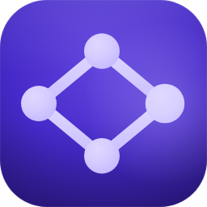
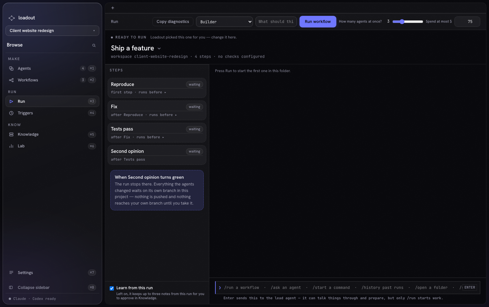
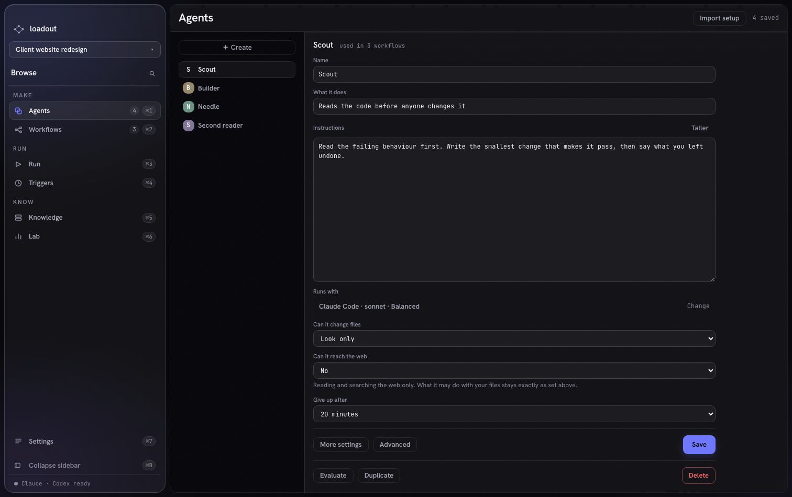
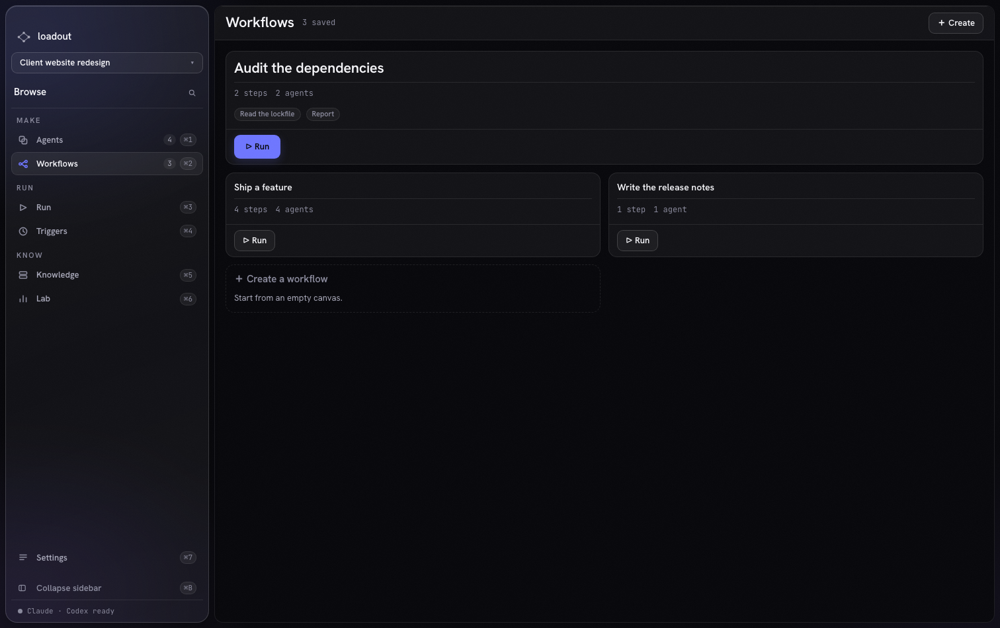

<p align="center">
  
</p>

<h1 align="center">Loadout</h1>

<p align="center">
  <strong>Build and run visual workflows for coding agents.</strong><br>
  Compose Claude Code, Codex, checks, commands, checkpoints, and loops on one canvas — then watch the work happen in one place.
</p>

<p align="center">
  
  
  
  
  
  
  
  <a href="LICENSE"></a>
</p>

<p align="center">
  <a href="https://github.com/loadout-io/loadout/releases/latest"><strong>Download for macOS</strong></a>
  ·
  <a href="https://github.com/loadout-io/loadout/actions/workflows/ci.yml">CI</a>
  ·
  <a href="docs/ARCHITECTURE.md">Architecture</a>
</p>



## One graph owns the work

Loadout is a native macOS control room for coding agents. Define an agent once, place it on a
workflow canvas, connect the steps, and run the graph against a project. Execution order,
parallel branches, fan-in, retries, checkpoints, and handoffs all come from the saved graph — no
stage is hard-coded into the engine.

The canvas is where you *build* a workflow. The Run screen is where you *watch* one: the plan
reads top to bottom, each card naming the step it waits for, and the stream beside it carries
what every agent said, in order, with the question that stopped the run pinned where you will
answer it.

Claude Code and Codex are first-class peers. A workflow can mix vendors and models, give every
agent a different working style and tool set, and keep implementation and review independent.

## New in 0.2 — the interface was rebuilt

0.1 shipped an engine with a UI on top of it. 0.2 rebuilds the UI around one rule: **each screen
has a single subject, and everything else on it is smaller, quieter, or further away.**

- **One navigation, two modes.** The icon column and the browse panel used to be two controls
  doing one job. They are now one sidebar, grouped by why you came — Make, Run, Know — that folds
  to icons with `⌘B` and remembers the choice.
- **A first run that leads.** An empty Loadout no longer answers with seven variations of
  "nothing here yet". It opens with a path — make an agent, put agents in a row, run it — and
  every section you cannot use yet says, in words, what it is waiting for.
- **A Run screen you can read.** The plan is a column of step cards, each naming the step it
  waits for by name. No invented order: two steps that wait for the same step say so, because
  the engine really does start them together.
- **Roles you can read without opening them.** Agents is a list beside an editor, so the whole
  role — its own words, its model, its file access — is on screen the moment you arrive.
- **Every screen says what happens next.** Empty states are invitations with a real button;
  refusals name the cause and offer a way out.



## What the app does

- **Visual workflows** — agent steps, local commands, checks, checkpoints, loops, conditional
  paths, retries, and reusable saved graphs.
- **Real parallel execution** — independent branches overlap in time instead of taking turns
  behind a single worker.
- **A live Run screen** — agent activity, durable history, questions, spawned commands, output,
  diagnostics, and spend stay together.
- **Reusable agents** — choose the vendor, model, reasoning depth, timeout, file access, tools,
  connections, and skills for each role.
- **Project-scoped knowledge** — curate instructions and useful notes on disk, then see which
  context was actually used by a run.
- **Triggers and recovery** — schedule workflows and recover interrupted work without inventing a
  second execution engine.
- **Evidence you can inspect** — run receipts, full attachments, handoffs, death proofs, and a
  diagnostic bundle remain available after the terminal output is gone.



## Built to fail honestly

Loadout treats orchestration failures as product failures, not terminal noise:

- overlapping write scopes are refused before the first process starts;
- cancellation terminates the whole process group and verifies that it is dead;
- timeouts travel through the same supervised shutdown path;
- prompts and secrets go through stdin, never command-line arguments;
- child environments are rebuilt from an explicit allowlist;
- unknown vendor events are recorded and ignored instead of crashing the run;
- a green exit code without proof that tests ran is not accepted as a green check;
- files are the source of truth, while SQLite remains a rebuildable index.

## Install

Loadout is packaged for Apple Silicon Macs.

1. Download [`Loadout_0.2.0_aarch64.dmg`](https://github.com/loadout-io/loadout/releases/latest).
2. Open the DMG and drag Loadout to Applications.
3. Launch it normally — the app and DMG are signed with Apple Developer ID, notarized, and
   stapled.
4. Install and authenticate at least one supported agent CLI: Claude Code or Codex.

Verify the download against the SHA-256 published with that release, then check the signature
yourself:

```bash
shasum -a 256 ~/Downloads/Loadout_0.2.0_aarch64.dmg
spctl --assess --type open --context context:primary-signature -v ~/Downloads/Loadout_0.2.0_aarch64.dmg
```

The checksum lives in the [release notes](https://github.com/loadout-io/loadout/releases/latest)
rather than in this file, so it always describes the build you actually downloaded.

## Run from source

Requirements: macOS, Node.js with npm, and the Rust toolchain pinned by
[`rust-toolchain.toml`](rust-toolchain.toml).

```bash
npm install
cargo fetch
npm run app
```

Use `npm run dev` when you only need the browser frontend without the Tauri backend.

## Verification

[`scripts/ci.sh`](scripts/ci.sh) is the single source of truth for the repository gate. GitHub
Actions calls the same script instead of maintaining a second list of checks.

```bash
bash scripts/ci.sh          # complete Rust + web gate
bash scripts/ci.sh rust     # formatting, clippy, tests, dependency policy, build
bash scripts/ci.sh web      # formatting, types, browser integration tests, vocabulary, build
```

Every released artifact is bound to the commit it was built from, and that commit's full CI
gate is linked from the release notes.

## Repository guide

| Path | Purpose |
|---|---|
| [`src/`](src/) | React interface: Run, Workflows, Agents, Knowledge, Lab, Triggers, Settings |
| [`src-tauri/src/engine/`](src-tauri/src/engine/) | graph execution, scheduling, drivers, supervision, recovery, and evidence |
| [`src-tauri/src/store/`](src-tauri/src/store/) | file-backed state and the rebuildable SQLite index |
| [`e2e/`](e2e/) | browser-level interaction and visible-behavior checks |
| [`checks/`](checks/) | deterministic repository checks discovered by the gate |
| [`harness/`](harness/) | task-contract runner, review, bounded repair, and receipts |
| [`docs/ARCHITECTURE.md`](docs/ARCHITECTURE.md) | current system shape and invariants |
| [`docs/DECISIONS-LOCKED.md`](docs/DECISIONS-LOCKED.md) | owner decisions that constrain the implementation |
| [`docs/STATUS.md`](docs/STATUS.md) | chronological build and task record |
| [`docs/design/DESIGN.md`](docs/design/DESIGN.md) | the visual system: what each rung, tone, and motion means |
| [`docs/mockup/index.html`](docs/mockup/index.html) | the drawing the interface is measured against |
| [`docs/screenshots/`](docs/screenshots/) | the screens as they ship |

## Current status

The repository contains the production Rust engine, Tauri desktop shell, React interface, both
agent drivers, recovery and supervision paths, browser interaction coverage, and the full task
harness. 0.2 rebuilt the interface on top of that engine without changing what the engine does.

`docs/mockup/index.html` is not decoration: two checks read the layout out of it during the test
run, so a screen that drifts from the drawing fails the gate rather than shipping.
